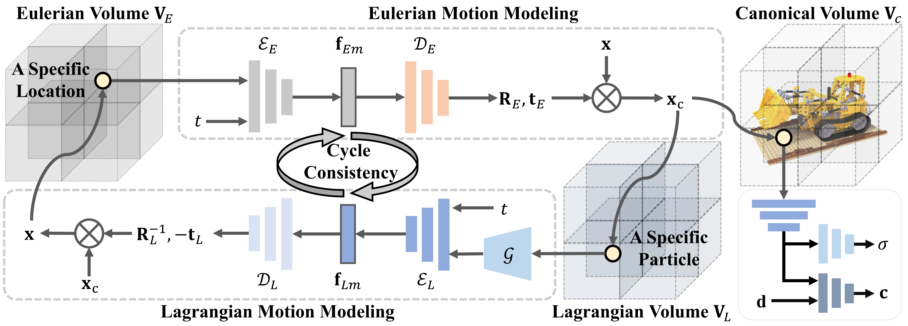

<div align="center">

  <h1 align="center">MovingParts: Motion-based 3D Part Discovery in Dynamic Radiance Field</h1>
  <h2 align="center">ICLR 2024 Spotlight</h2>

### [Project Page](https://silenkzyoung.github.io/MovingParts-WebPage/) | [Paper](https://openreview.net/pdf?id=QQ6RgKYiQq)

</div>

## 📖 Abstract
We present MovingParts, a NeRF-based method for dynamic scene reconstruction and part discovery.
We consider motion as an important cue for identifying parts, that all particles on the same part share the common motion pattern. 
From the perspective of fluid simulation, existing deformation-based methods for dynamic NeRF can be seen as parameterizing the scene motion under the Eulerian view, i.e., focusing on specific locations in space through which the fluid flows as time passes. 
However, it is intractable to extract the motion of constituting objects or parts using the Eulerian view representation. In this work, we introduce the dual Lagrangian view and enforce representations under the Eulerian/Lagrangian views to be cycle-consistent. 
Under the Lagrangian view, we parameterize the scene motion by tracking the trajectory of particles on objects. 
The Lagrangian view makes it convenient to discover parts by factorizing the scene motion as a composition of part-level rigid motions. 
Experimentally, our method can achieve fast and high-quality dynamic scene reconstruction from even a single moving camera, and the induced part-based representation allows direct applications of part tracking, animation, 3D scene editing, etc.

## 🚀 Network

<div align="center">

</div>

## 🚀 Setup

#### Environment setup 
The code is tested under Python 3.8.13, CUDA 10.2, and PyTorch 1.11.0.
```
git clone https://github.com/SilenKZYoung/MovingParts.git
cd MovingParts
conda env create -f environment.yml
```

#### Dataset
Please download the D-NeRF 360 synthetic dataset from [dropbox](https://www.dropbox.com/s/0bf6fl0ye2vz3vr/data.zip?dl=0) and put it under the ./data. See the following directory structure for an example:
```
├── data 
│   ├── mutant
│   ├── standup 
│   ├── ...
```

#### Run the codes
```
# Train
python train.py --logdir ./log --data_dir ./data/XXX/
# Test
python train.py --ckpt ./log/XXX/XXX.th --data_dir ./data/XXX/
```

## 🚀 License
MIT License
